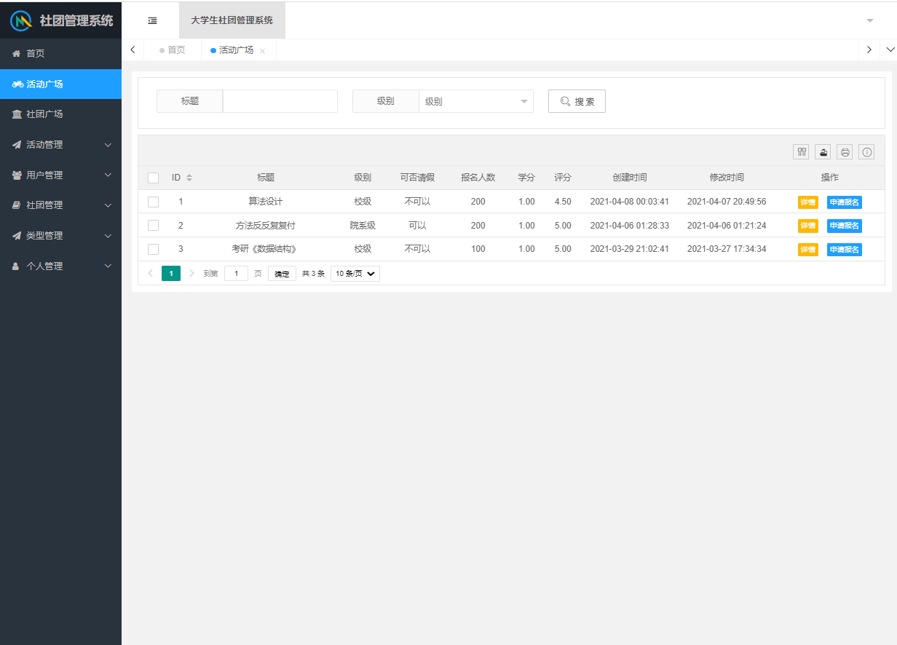
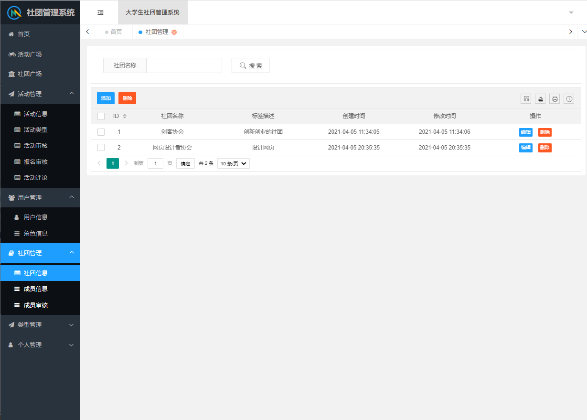
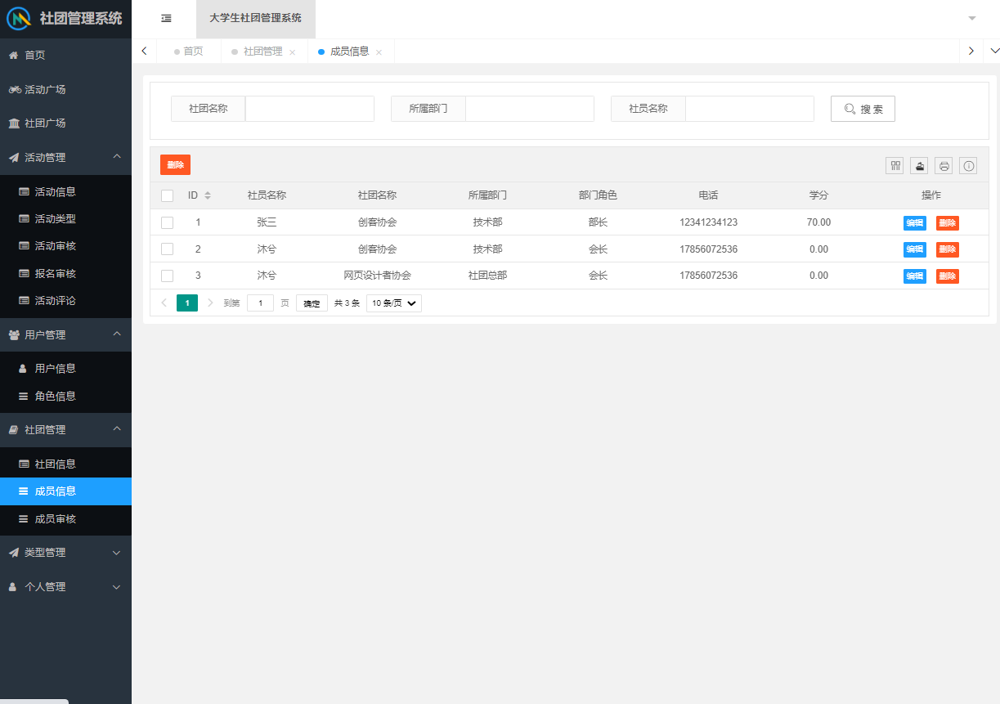
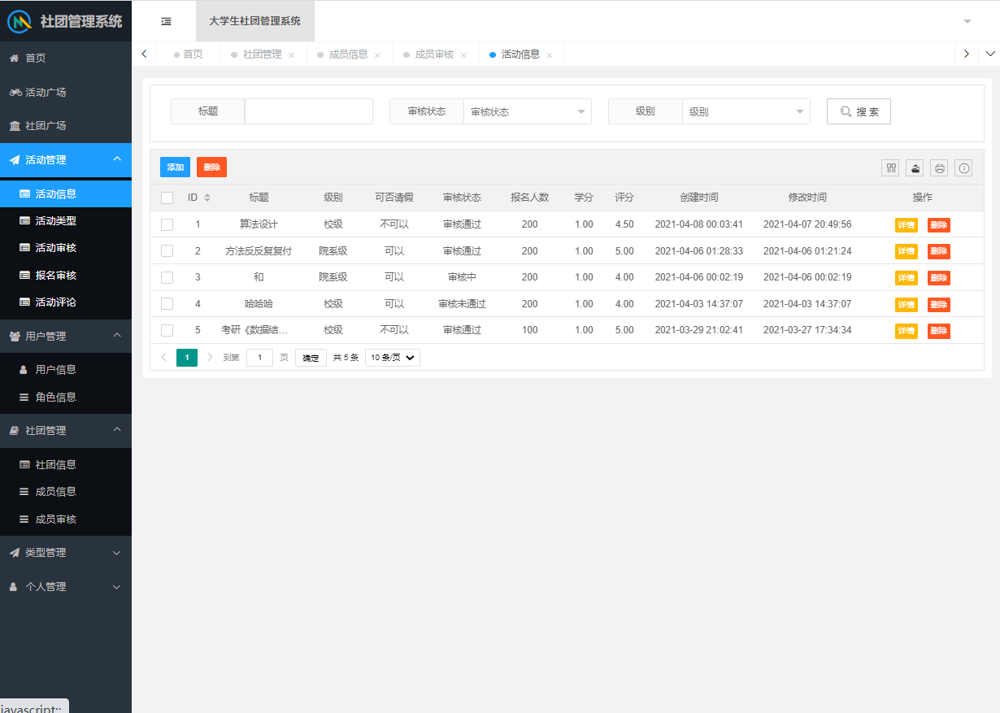
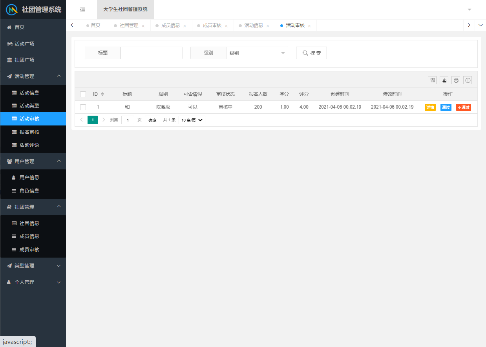
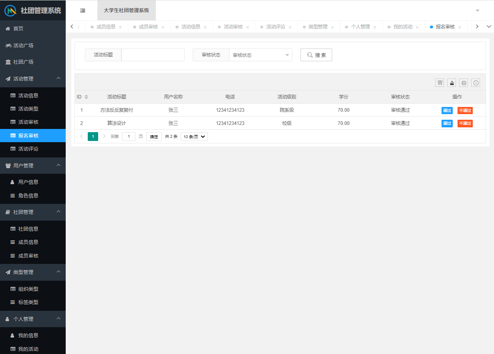
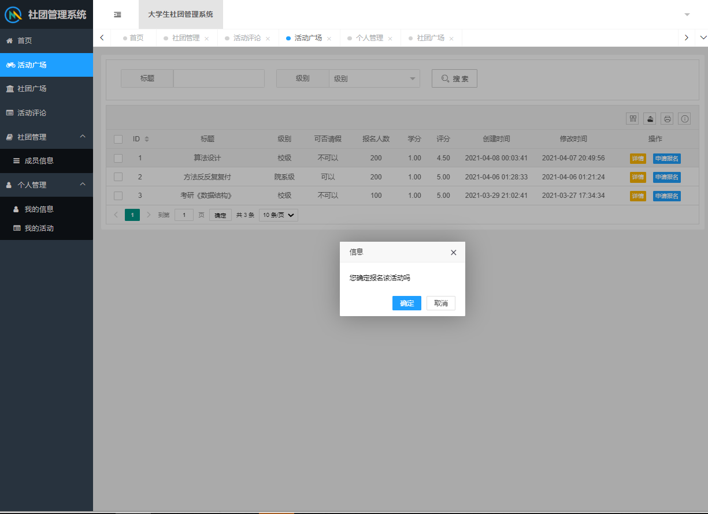
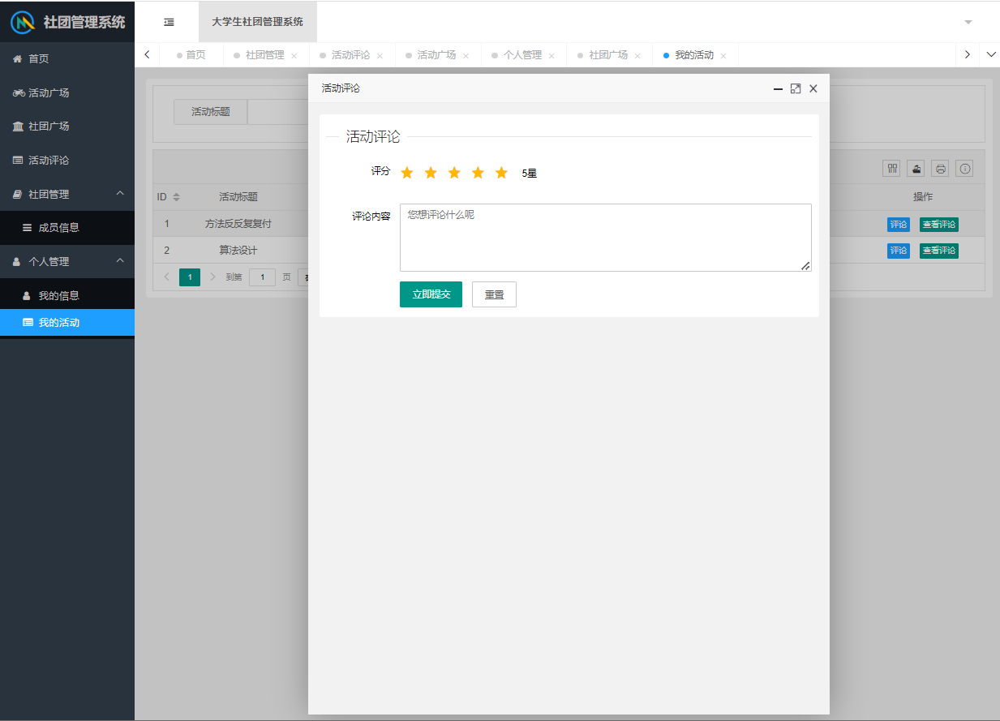

**需要完整代码可以加qq  931708230 或者加微信 ynwwxid**

**需要完整代码可以加qq  931708230 或者加微信  ynwwxid**

#程序员 #java #毕业设计 #大学生社团管理系统 #springboot #课程设计 #编程 #layui #mybatis-puls #源代码 #ssm

## Spring Boot  大学生社团管理系统

#### 软件架构
平台使用基于springboot搭建的，技术主要是spring，springmvc，mybatis-puls，
layui，mysql版本5.7，开发工具idea 2021

###功能介绍
活动管理：活动信息、活动审核、报名活动、报名审核、活动评论等

用户管理：用户信息、角色信息

社团管理：社团信息、成员信息、成员审核

类型管理

个人管理：我的信息、我的活动

##角色
校级管理员、院级管理员、学生

##运行地址
http://localhost:8121/back/login

校级管理员- 账号：123456    密码：admin   
院级管理员- 账号：17856072536    密码：aaa  
学生- 账号：12341234123    密码：aa  

部分功能截图

  
  
  
  
  
  
  
  
  
  
  
  
  
  
  

#### 安装教程

1.  使用idea导入项目
2.  修改配置文件
3.  导入数据库
4.  账号密码为user表里的phone和password字段

#### 使用说明

1.  运行之后输入localhost:8080/back/login进入登录界面
2.  在数据库里面查看账号，三种账号显示不同基本的后台目录

### 基础环境 :IDEA/eclipse，maven3.6+，JDK 1.8 ， Mysql 5.7

### 源码+数据库脚本 

所有项目以及源代码本人均调试运行无问题 可支持远程调试运行
	
**需要完整代码可以加qq  931708230 或者加微信 ynwwxid**

**需要完整代码可以加qq  931708230 或者加微信  ynwwxid**

